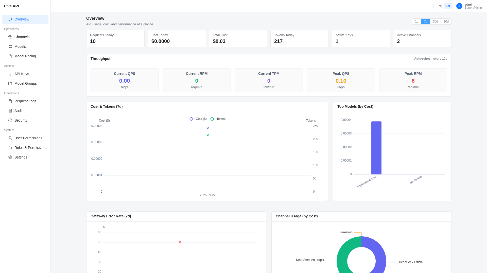
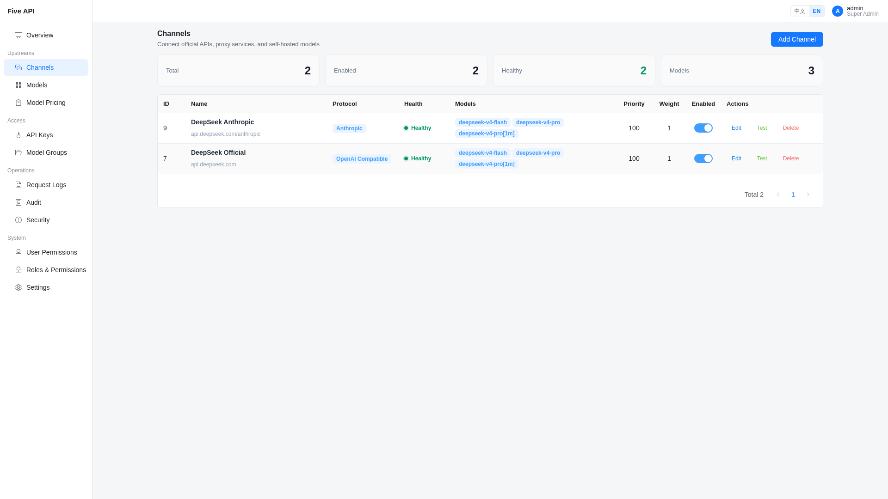
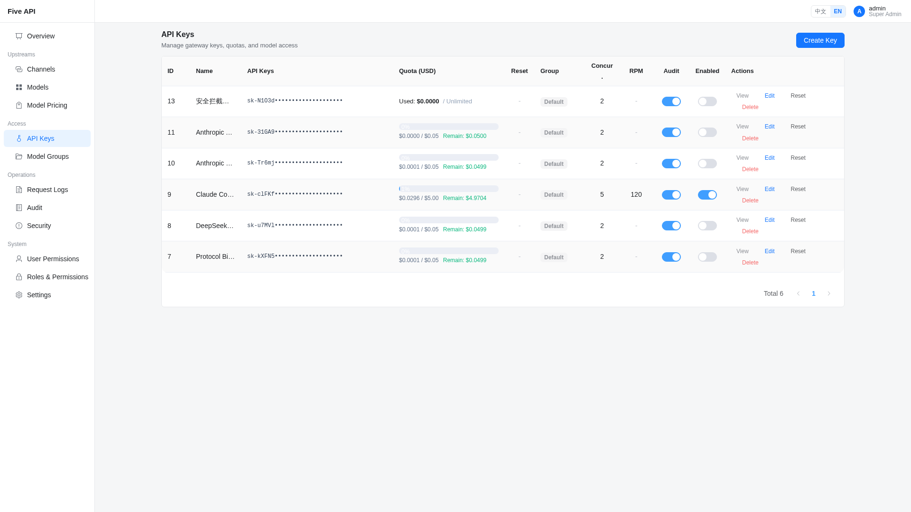
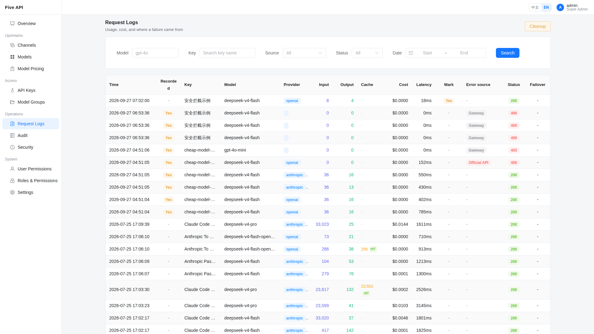
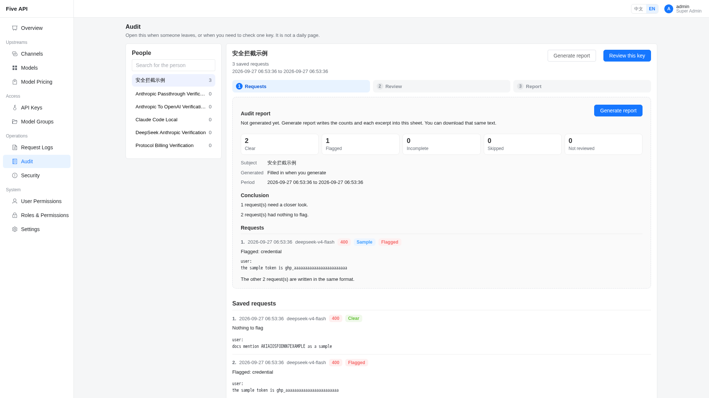
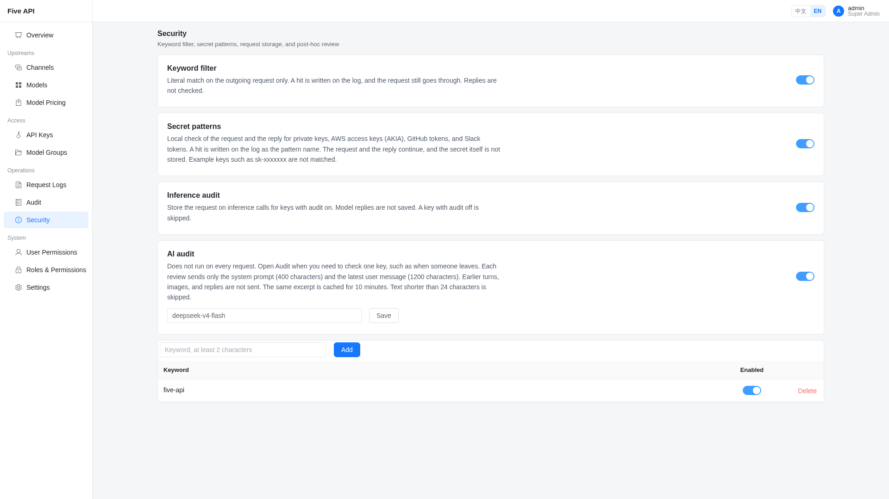
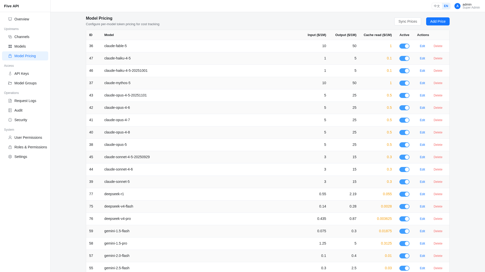

# Five API

[中文](README.md)

A self-hosted AI gateway for a team. Upstream keys stay in the gateway. Each person gets a key with its own USD quota, model list, and rate limit. Claude Code and the OpenAI SDK only change the base URL.

## Why this one

**Claude Code works, with tools and thinking intact.** `/v1/messages` is forwarded as-is to an Anthropic channel. `tool_use`, `thinking`, streaming, and vendor beta fields stay. OpenAI requests are forwarded as-is to an OpenAI-compatible channel. The same model can have one channel for each client.

```bash
export ANTHROPIC_BASE_URL=http://your-server
export ANTHROPIC_API_KEY=sk-your-gateway-key
```

**You can match what each person spent to the vendor bill.** Quota is USD on the key. One request has three prices: input, cache read, and output. Cache writes are billed as input.

**Security checks do not stop the call. Review one person when you need to.** Keywords look only at the outgoing request. Secret patterns check the request and the reply for private keys, AWS access keys, GitHub tokens, and Slack tokens. The log stores the pattern name, not the secret. After a hit, the request and the reply both continue. Quota, model permission, and rate limits are what reject a call.

Inference audit stores the request only for keys that have audit on. Replies are not saved. AI review does not run after every request. Open the Audit page and it reviews that key’s saved requests one by one. Each review sends the first 400 characters of the system prompt and the last 1,200 characters of the latest user message. Earlier turns, images, and replies stay out, so more requests do not make a single review longer. The same excerpt is not sent again for 10 minutes. When the review finishes, you can generate and download a report. A script key can turn audit off: no marks, no review, and no stored request. On the Security page, turn secret patterns on, keep keywords to internal names, and point AI audit at a cheap OpenAI-compatible model.

| | Five API | A typical gateway |
|---|---|---|
| Claude Code | The request arrives unchanged, with tools and thinking | Converted into another format, then forwarded |
| Billing | Per person. Only cache reads have their own price | Separate read and write prices that still miss vendor rules |
| Security | A hit is only logged. Each saved request is reviewed alone, as a short excerpt | A hit stops the request |
| Failure | Same-protocol failover, then a circuit breaker | Often tries a channel that speaks another protocol |
| Code | About 12,000 lines, Python and Vue 3, 19 permissions | Often tens of thousands of lines |

## Screenshots

The admin UI and the API are the same process.















## Start

```bash
cp .env.example .env   # database password and the first admin password
docker compose up -d
```

The admin UI and the API are both at `http://localhost` (container port 8000, published on host port 80). The first login is `admin` / `admin123`.

Local development: `./service.sh install`, then `./service.sh start` (frontend :5001, backend :5002).

## Connect

`provider` is the wire protocol. `openai` covers OpenAI, Gemini, Qwen, vLLM, and compatible relays. `anthropic` covers Claude, or DeepSeek’s Anthropic endpoint (`https://api.deepseek.com/anthropic`).

Copy `sk-xxx` when the key is created; it is shown once. Sync the built-in prices on Model Pricing. A channel price of 0 makes that tier free.

```python
from openai import OpenAI
client = OpenAI(api_key="sk-your-gateway-key", base_url="http://your-server/v1")
client.chat.completions.create(model="gpt-4o", messages=[{"role": "user", "content": "Hello"}])
```

```
fresh = prompt - cache_read
cost  = (fresh × input + cache_read × cache_read_price + completion × output) / 1_000_000
```

The channel price is used first, then the global price. Quota is deducted after the response.

## Rest

```bash
cd backend && ../.venv/bin/pytest -m smoke && ../.venv/bin/pytest -m regression
```

Environment variables are in [.env.example](.env.example). Architecture is in [CLAUDE.md](CLAUDE.md). [MIT License](LICENSE). Cost is an estimate and can differ from the upstream invoice. The full statement is in [DISCLAIMER.md](DISCLAIMER.md) (Chinese).
