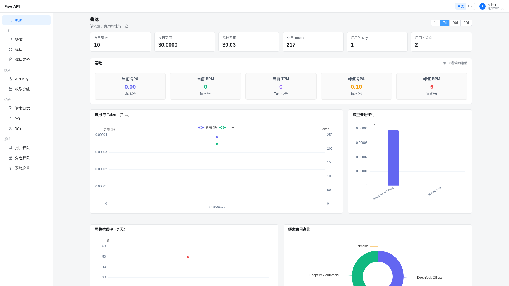
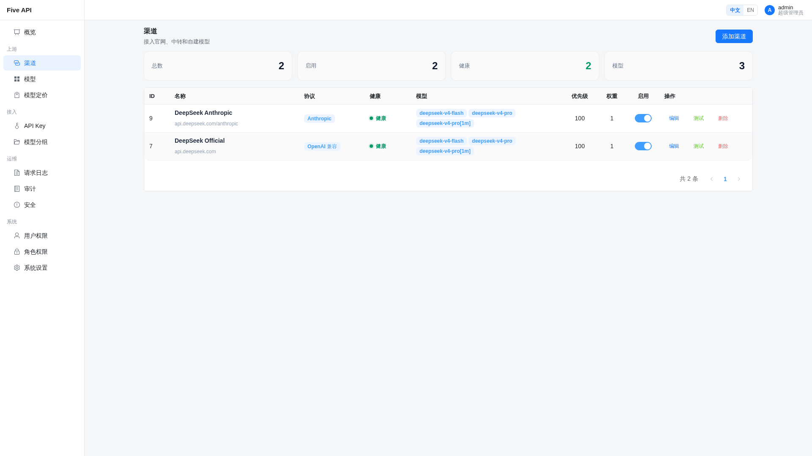
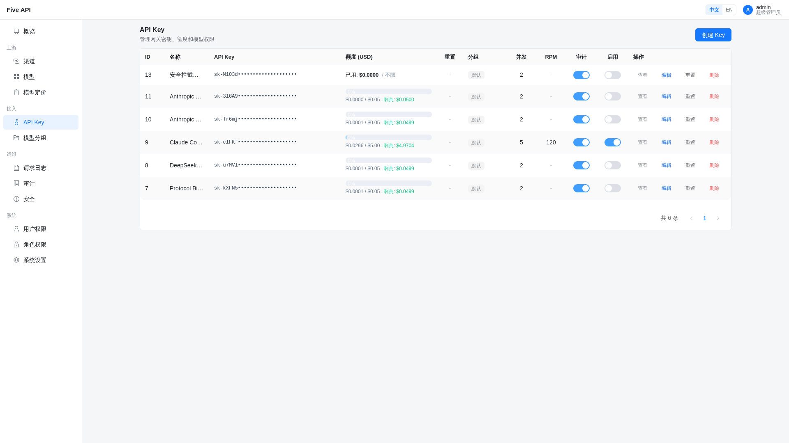
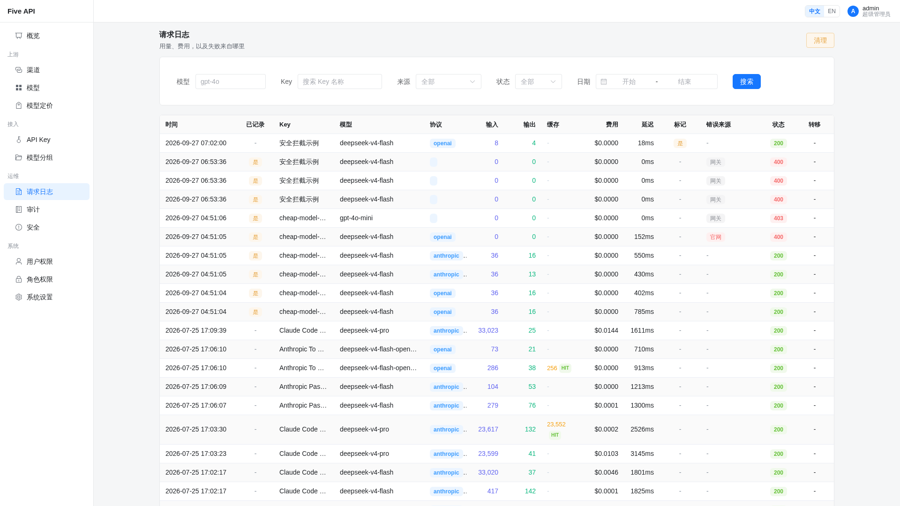
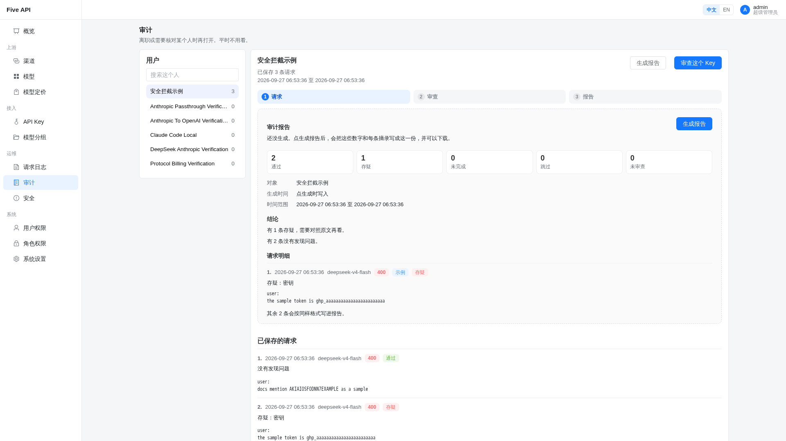
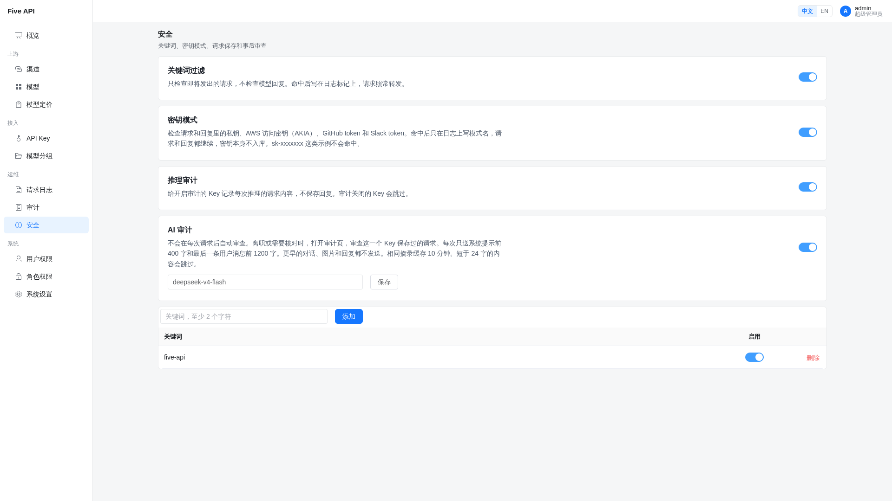
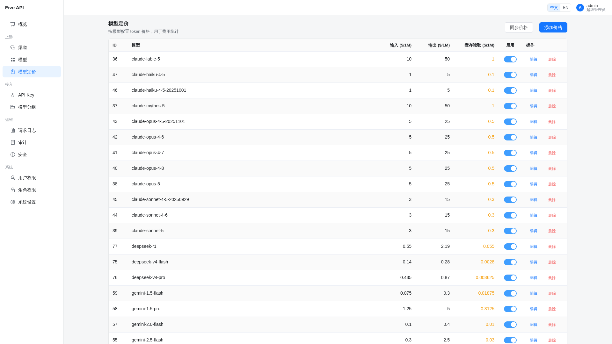

# Five API

[English](README.en.md)

自托管的团队 AI 网关。上游 Key 留在网关里。每个人拿自己的 Key，带独立的美元配额、可用模型和限流。Claude Code 和 OpenAI SDK 只改地址。

## 优势

**Claude Code 直接能用，工具和 thinking 都在。** `/v1/messages` 原样进 Anthropic 渠道，`tool_use`、`thinking`、流式和厂商 Beta 都保留。OpenAI 请求同样原样进 OpenAI 兼容渠道。同一个模型可以建两条渠道，各接各的客户端。

```bash
export ANTHROPIC_BASE_URL=http://your-server
export ANTHROPIC_API_KEY=sk-your-gateway-key
```

**每个人花了多少钱，能和厂商账单对上。** 额度按美元记在 Key 上。一次请求三档：输入、缓存读取、输出。缓存写入算在输入里，不再单独标价。

**安全检查不打断调用。要查一个人，再按 Key 审。** 关键词只看即将发出的请求。密钥模式检查请求和回复里的私钥、AWS 访问密钥、GitHub token 和 Slack token，日志只写模式名，密钥原文不入库。命中之后请求和回复都继续。配额、模型权限和限流才会拒绝。

推理审计只给打开审计的 Key 保存请求，不保存回复。AI 审查不跟在每次请求后面。打开审计页，这个 Key 保存过的请求逐条审查，每条只送系统提示开头 400 字和最后一条用户消息末尾 1200 字。更早的对话、图片和回复都不送，所以请求再多，单次上下文的长度也不变。相同摘录 10 分钟内不重复送。审完可以生成报告并下载。脚本类 Key 可以关掉审计，这个 Key 就不标记、不审查、也不存请求正文。安全页建议打开密钥模式，关键词只加内部代号，AI 审计填一个便宜的 OpenAI 兼容模型。

| | Five API | 常见网关 |
|---|---|---|
| Claude Code | 请求原样到达上游，工具和 thinking 还在 | 转成另一种格式后再转发 |
| 计费 | 按人记账，只把缓存读取单独打折 | 缓存读写各开一档，厂商规则还对不齐 |
| 安全 | 命中只记日志。按 Key 逐条审，每条只送一小段摘录 | 命中就中断这次请求 |
| 故障 | 同协议渠道切换，连续失败后熔断 | 常常跨协议找下一家 |
| 代码 | 约 1.2 万行，Python + Vue 3，19 项权限 | 往往数万行 |

## 界面

管理后台和 API 在同一个进程里。















## 启动

```bash
cp .env.example .env   # 改数据库密码和初始管理员密码
docker compose up -d
```

管理后台和 API 都在 `http://localhost`（容器内 8000，默认映射到宿主机 80）。默认账号 `admin` / `admin123`。

本地开发：`./service.sh install` 然后 `./service.sh start`（前端 :5001，后端 :5002）。

## 接入

渠道的 `provider` 是线协议。`openai` 接 OpenAI、Gemini、千问、vLLM 和兼容中转；`anthropic` 接 Claude 或 DeepSeek 的 Anthropic 端点（`https://api.deepseek.com/anthropic`）。

创建 Key 后复制 `sk-xxx`（只显示一次）。模型定价页同步一次内置价格。渠道上某档价格设成 0，这一档就免费。

```python
from openai import OpenAI
client = OpenAI(api_key="sk-your-gateway-key", base_url="http://your-server/v1")
client.chat.completions.create(model="gpt-4o", messages=[{"role": "user", "content": "Hello"}])
```

```
fresh = prompt - cache_read
cost  = (fresh × 输入价 + cache_read × 缓存读价 + completion × 输出价) / 1_000_000
```

先用渠道价，再用全局价。配额在响应返回后扣减。

## 其他

```bash
cd backend && ../.venv/bin/pytest -m smoke && ../.venv/bin/pytest -m regression
```

环境变量见 [.env.example](.env.example)。架构见 [CLAUDE.md](CLAUDE.md)。[MIT License](LICENSE)。费用是估算，可能和上游账单不一致，说明见 [法律风险与免责声明](DISCLAIMER.md)。
